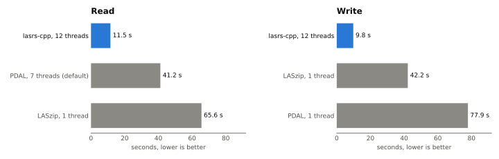

# lasrs-cpp

[](https://github.com/bloom256/lasrs-cpp/actions/workflows/ci.yml)
[](https://github.com/bloom256/lasrs-cpp/releases)
[](#license)

Fast LAS / LAZ / COPC reading and writing for C++, powered by the Rust
crate [las-rs](https://github.com/gadomski/las-rs) and its parallel LAZ
codec [laz-rs](https://github.com/tmontaigu/laz-rs).

> **v0.1:** the complete las-rs 0.11 API, tested on Windows, Linux and
> macOS (x64 and arm64), with prebuilt releases. As usual for 0.x
> versions, the API may still change between minor releases.

## Why

las-rs decompresses LAZ chunks in parallel on all cores. lasrs-cpp brings
that speed to C++ without re-implementing the codec: the Rust crates sit
behind a small C ABI and a modern C++20 API.

On a public 952 MB LAZ file with 105.6 million points, lasrs-cpp reads
3.6x faster than PDAL and 5.7x faster than LASzip, and writes 4.3x faster
than LASzip and 7.9x faster than PDAL (see [Performance](#performance)).

<picture>
  <source media="(prefers-color-scheme: dark)" srcset="docs/images/benchmark-dark.svg">
  
</picture>

## Features

- The las-rs API in C++, with the same names: if you know las-rs, you
  know lasrs-cpp
- LAS 1.0 - 1.4, point formats 0 - 10, extra bytes, waveform fields
- LAZ read and write, parallel over chunks
- COPC read: hierarchy access, level-of-detail and bounds queries
- Header, VLR / EVLR, CRS (WKT, GeoTIFF keys)
- Bulk access: read points in batches, as `Point` structs, as columns
  (`x()`, `intensity()`, ...) or as raw record bytes
- Read from paths or any `std::istream`, write to paths or any
  `std::ostream`
- Header-only C++20 wrapper with RAII and exceptions, plus a plain C API
- Static linking: no Rust runtime and no extra DLLs in your application

## Examples

Read a file in batches:

```cpp
#include <lasrs/lasrs.hpp>

#include <iostream>

int main()
{
    auto reader = las::Reader::from_path("cloud.laz");
    std::cout << reader.header().number_of_points() << " points\n";

    auto points = las::PointDataBuilder().for_header(reader.header()).build();
    while (reader.fill_points(1'000'000, points) != 0)
    {
        for (double z : points.z())
        {
            // ...
        }
    }
}
```

Write a LAZ file:

```cpp
las::Builder builder(las::Version(1, 4));
builder.point_format = las::point::Format(6);
auto writer = las::Writer::from_path("out.laz", builder.into_header());

las::Point point;
point.x = 1.0;
point.gps_time = 42.0;
writer.write_point(point);
writer.close();
```

Query a COPC file:

```cpp
auto reader = las::CopcReader::from_path("cloud.copc.laz");
const las::Bounds area{{637000, 851000, 0}, {638000, 852000, 1000}};
auto points = reader.query(las::LodSelection::Resolution(1.0), las::BoundsSelection::Within(area));
```

## Performance

AHN4 tile 25GN2_18 (Amsterdam, public domain): 105.6 million points, LAS 1.4
point format 8, 952 MB. Intel Core i7-10750H (6 cores, 12 threads), 32 GB,
Windows 11; best of 3 runs, each case in its own process, file in the OS
cache. The chart at the top shows each library in its fastest
configuration; all configurations are in the tables below.

**Read**

| Library | Threads | Seconds | Million points/s | Peak memory (MB) |
|---|---|---:|---:|---:|
| **lasrs-cpp** | **12** | **11.5** | **9.2** | 99 |
| laspy 2.7 + lazrs | 12 | 12.6 | 8.4 | 139 |
| PDAL 2.10 | 7 (default) | 41.2 | 2.6 | 84 |
| PDAL 2.10 | 12 | 43.1 | 2.5 | 126 |
| laz-perf 3.4 | 1 | 63.6 | 1.7 | 16 |
| LASzip 3.4 | 1 | 65.6 | 1.6 | 1 |
| lasrs-cpp | 1 | 66.0 | 1.6 | 47 |
| PDAL 2.10 | 1 | 67.1 | 1.6 | 33 |
| laspy 2.7 + lazrs | 1 | 67.6 | 1.6 | 89 |

**Write**

| Library | Threads | Seconds | Million points/s | Peak memory (MB) |
|---|---|---:|---:|---:|
| **lasrs-cpp** | **12** | **9.8** | **10.8** | 89 |
| laspy 2.7 + lazrs | 12 | 10.9 | 9.7 | 84 |
| lasrs-cpp | 1 | 39.3 | 2.7 | 0 |
| laspy 2.7 + lazrs | 1 | 41.7 | 2.5 | 0 |
| LASzip 3.4 | 1 | 42.2 | 2.5 | 136 |
| laz-perf 3.4 | 1 | 46.8 | 2.3 | 0 |
| PDAL 2.10 | 1 | 77.9 | 1.4 | 10 |

- Single-threaded, all LAZ codecs are about equally fast; lasrs-cpp wins by
  using all cores.
- Parallel decoding costs memory: about 100 MB instead of 47 MB for
  lasrs-cpp, because several LAZ chunks are decompressed at once. Reads
  stream in 1M-point batches, so memory does not grow with the file.
- Peak memory is how much the process grew during the timed operation;
  write benchmarks get their input points already in memory, which is not
  counted.
- Every written file was checked to hold exactly the input points. PDAL's
  writer drops extra bytes by default; its standard fields are identical.

Reproduce with [benchmarks/](benchmarks/README.md): `pixi run bench`
downloads this file and writes the tables, the verification and all written
files to `test_data/output/bench/`.

## Tested platforms

Every push runs these in [CI](https://github.com/bloom256/lasrs-cpp/actions/workflows/ci.yml):

| Platform | Arch | Compiler | What runs |
|---|---|---|---|
| Windows | x64 | MSVC | full test suite (Debug, Release), bundle |
| Ubuntu 24.04 | x64 | GCC 13, Clang 18 | full test suite (Debug, Release), sanitizers, bundle |
| Ubuntu 24.04 | arm64 | GCC 13 | full test suite (Debug, Release), bundle |
| macOS (Apple Silicon) | arm64 | Apple Clang | full test suite (Debug, Release), bundle |
| macOS (Intel) | x64 | Apple Clang | full test suite (Debug, Release), bundle |

The prebuilt Linux bundles (built on Ubuntu 24.04) are then tested on other
distributions, on both x64 and arm64:

| Distribution | glibc | Compiler | What runs |
|---|---|---|---|
| Rocky Linux 8 | 2.28 | GCC 13 (gcc-toolset) | full test suite, C API test |
| Ubuntu 20.04 | 2.31 | GCC 9 | C API test |
| Rocky Linux 9 | 2.34 | GCC 11 | full test suite, C API test |
| Ubuntu 22.04 | 2.35 | GCC 11 | full test suite, C API test |
| Debian 12 | 2.36 | GCC 12 | full test suite, C API test |
| Ubuntu 24.04 | 2.39 | GCC 13 | full test suite, C API test |
| Fedora (latest) | latest | latest GCC | full test suite, C API test |
| Arch Linux (x64 only) | latest | latest GCC | full test suite, C API test |

Ubuntu 20.04 ships a compiler without the C++20 library features the C++
headers use (`std::chrono` calendar types), so only the C API is tested
there; the library itself works on it.

## Mapping from las-rs

Names and semantics follow las-rs. Where Rust and C++ differ:

| las-rs | lasrs-cpp |
|---|---|
| `las::Reader::from_path(p)` | `las::Reader::from_path(p)` |
| `X::new(...)` | constructor `X(...)` |
| `Result<T>` | returns `T`, throws `las::Error` |
| `Option<T>` | `std::optional<T>` |
| `&str`, `&[u8]` | `std::string_view`, `std::span<const uint8_t>` |
| iterator (`pd.x()`) | `std::vector` |
| `impl Read + Seek` / `impl Write + Seek` | `std::istream&` / `std::ostream&` |
| method on an enum (`t.is_standard()`) | free function (`is_standard(t)`) |
| `NaiveDate`, `Uuid` | `std::chrono::year_month_day`, `std::array<uint8_t, 16>` |

las-rs cannot write COPC, so neither can lasrs-cpp.

## Getting it

### Prebuilt bundles (no Rust needed)

Let CMake download the bundle for your platform from the
[releases](https://github.com/bloom256/lasrs-cpp/releases):

```cmake
set(LASRS_VERSION v0.1.0)
if(WIN32)
  set(lasrs_platform windows-x64)
  if(CMAKE_MSVC_RUNTIME_LIBRARY MATCHES "^MultiThreaded(Debug)?$")
    set(lasrs_platform windows-x64-static-crt)
  endif()
  set(lasrs_archive zip)
else()
  if(CMAKE_SYSTEM_PROCESSOR MATCHES "^(arm64|aarch64)$")
    set(lasrs_arch arm64)
  else()
    set(lasrs_arch x64)
  endif()
  if(APPLE)
    set(lasrs_platform macos-${lasrs_arch})
  else()
    set(lasrs_platform linux-${lasrs_arch})
  endif()
  set(lasrs_archive tar.gz)
endif()

if(POLICY CMP0135)
  cmake_policy(SET CMP0135 NEW)
endif()
include(FetchContent)
FetchContent_Declare(lasrs
  URL https://github.com/bloom256/lasrs-cpp/releases/download/${LASRS_VERSION}/lasrs-cpp-${LASRS_VERSION}-${lasrs_platform}.${lasrs_archive})
FetchContent_MakeAvailable(lasrs)
find_package(lasrs CONFIG REQUIRED PATHS ${lasrs_SOURCE_DIR} NO_DEFAULT_PATH)

target_link_libraries(my_app PRIVATE lasrs::lasrs)
```

Or download an archive yourself and point CMake at it with
`-DCMAKE_PREFIX_PATH=<extracted archive>` and `find_package(lasrs REQUIRED)`:

| Your build | Download |
|---|---|
| Windows x64, MSVC, dynamic CRT (`/MD`, the default) | `lasrs-cpp-vX.Y.Z-windows-x64.zip` |
| Windows x64, MSVC, static CRT (`/MT`) | `lasrs-cpp-vX.Y.Z-windows-x64-static-crt.zip` |
| Linux x64, glibc 2.28 or newer | `lasrs-cpp-vX.Y.Z-linux-x64.tar.gz` |
| Linux arm64, glibc 2.28 or newer | `lasrs-cpp-vX.Y.Z-linux-arm64.tar.gz` |
| macOS Apple Silicon | `lasrs-cpp-vX.Y.Z-macos-arm64.tar.gz` |
| macOS Intel | `lasrs-cpp-vX.Y.Z-macos-x64.tar.gz` |

Each archive holds `include/`, the static library in `lib/`, a CMake
package in `lib/cmake/lasrs/` and the licenses in `share/lasrs/`. Check a
download against `SHA256SUMS.txt`, or its build provenance with
`gh attestation verify <archive> --repo bloom256/lasrs-cpp`. Linking
without CMake is described in [docs/BUILDING.md](docs/BUILDING.md).

### From source (needs Rust)

```cmake
include(FetchContent)
FetchContent_Declare(lasrs
  GIT_REPOSITORY https://github.com/bloom256/lasrs-cpp.git
  GIT_TAG main)
FetchContent_MakeAvailable(lasrs)
target_link_libraries(my_app PRIVATE lasrs::lasrs)
```

See [docs/BUILDING.md](docs/BUILDING.md) for the toolchain.

## Project practices

- Every push and pull request is built and tested by GitHub Actions on
  Windows, Linux and macOS; the CI badge above shows the current status.
- Formatting (cargo fmt, clang-format), linting (clippy), a check that
  the committed C header is up to date, license checks (cargo deny) and
  sanitizers run in CI.
- Dependabot keeps GitHub Actions and Rust dependencies up to date; CodeQL
  scans the C/C++, Rust and workflow code.
- Security issues: see [SECURITY.md](SECURITY.md); community rules:
  [CODE_OF_CONDUCT.md](CODE_OF_CONDUCT.md).
- Semantic versioning and a human-readable [CHANGELOG](CHANGELOG.md).

## Documentation

- [docs/BUILDING.md](docs/BUILDING.md) - toolchain and build instructions
- [docs/ARCHITECTURE.md](docs/ARCHITECTURE.md) - how the pieces fit together
- [docs/ROADMAP.md](docs/ROADMAP.md) - milestones and open questions
- [CONTRIBUTING.md](CONTRIBUTING.md) - how to contribute
- [CHANGELOG.md](CHANGELOG.md) - release notes

## License

Licensed under either of

- Apache License, Version 2.0 ([LICENSE-APACHE](LICENSE-APACHE))
- MIT license ([LICENSE-MIT](LICENSE-MIT))

at your option.

The static library also contains code from third-party Rust crates
(las-rs is MIT, laz-rs is Apache-2.0); their licenses must be preserved
when distributing binaries.

### Contribution

Unless you explicitly state otherwise, any contribution intentionally
submitted for inclusion in the work by you, as defined in the Apache-2.0
license, shall be dual licensed as above, without any additional terms or
conditions.
